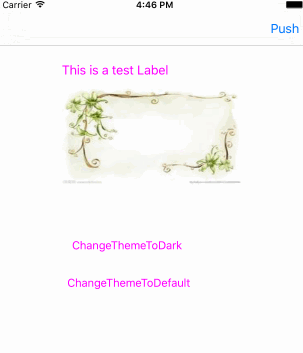

# YRTheme
==============
&nbsp;
&nbsp;

Easy to use util to help developer to change app theme.

> 开发中常常遇到切换主题，夜间模式什么的，一般的做法都是变了新主题就判断一下重新设置新值，代码量较多还不够清晰。  
> 本库将主题素材与代码进行了分离，力求一次代码绑定，后续只需要更改素材即可实现主题样式更改  
 

Install  
===========
-  使用pod

		pod 'YRTheme'
使用Pod安装的，只包含YRTheme和YRThemeManager两个类，具体的theme素材获取方法需要自行实现，或者也可以手动下载本demo中做了实现的ThemeHelper类。

- 手动安装，下载代码，拷贝项目下YRTheme/ThemeHelper、YRTheme/YRTheme两个目录到工程中即可

Features
============

- 使用 YRThemeManager 对界面上的常用控件进行颜色名称和图片名称的绑定, 当主题变化时 , 新的主题皮肤会自动应用到之前绑定的各个控件上  
- 切换主题只需一行代码:[[YRTheme shared]setCurrentThemeName:@"Dark"]  
- 使用弱引用对象进行控件存储和查找匹配，无需担心内存问题
- 可根据不同开发者需求，自行定制主题和不同主题下元素的获取功能，扩展性更强

Usage
==============
1. 在不同的主题皮肤配置文件中设置好相同键名的颜色、图片等等。在例子中，主题名称为Default的，对应的配置文件为DefaultColor.plist和DefaultImage.plist，当然，你可以根据自己需求重新定制主题和各素材名称匹配获取方式，例子中我实现了的主题素材获取处理类为ThemeHepler。
2. 在程序用对常用控件进行主题绑定，绑定代码基本如下  

		_manager = [[YRThemeManager alloc]init];
		//绑定各种控件数据
	    [_manager bindView:self.view bgColorName:@"commonBgColor"];
		[_manager bindImageView:self.imageView imageName:@"testImage1"];
    	[_manager bindLabel:self.label titleColorName:@"labelTitleColor"];
    	[_manager bindButton:self.button titleColorName:@"labelTitleColor" state:UIControlStateNormal];
    	[_manager bindButton:self.button titleColorName:@"buttonHighlight" state:UIControlStateHighlighted];
        //绑定复杂属性
        [_manager bindView:self.label block:^(id value) {
        selfWeak.label.layer.borderWidth = [value floatValue];
        } byName:@"commonBorderWidth"];
    
3. 变更主题皮肤

	    // 全局主题更改
   		[[YRTheme shared]setCurrentThemeName:@"Dark"];
    	// 仅当前manager管理的主题更改
   		[_manager updateToTheme:@"Dark"];
    
4. 如果遇到实在无法绑定的属性，那最后还可以通过监听kYRThemeChangeNotification来处理主题变更的功能。
 

## Author

wangxiaoyu, wxy_yueruo@126.com

## License

YRTheme is available under the MIT license. See the LICENSE file for more info.

---
更多内容请查看DEMO

